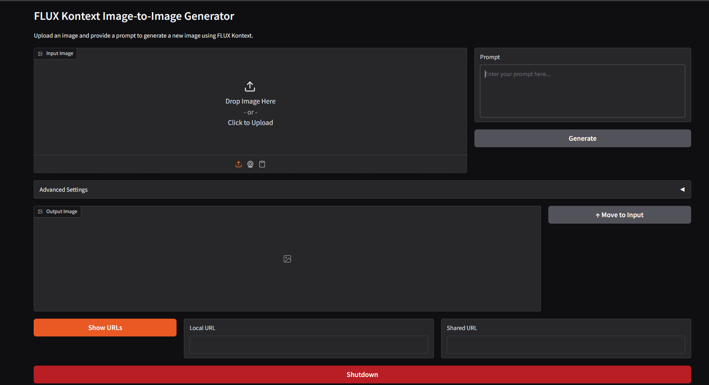

# FLUX Kontext Image-to-Image Generator

A powerful Gradio-based web interface for FLUX Kontext, enabling high-quality image-to-image transformations using AI. This application provides an intuitive interface for generating new images based on input images and text prompts.



## Features

- **Image-to-Image Generation**: Transform existing images using text prompts
- **Advanced Settings**: Control guidance scale and inference steps for fine-tuning
- **Iterative Workflow**: Move output images back to input for progressive refinement
- **Memory Optimization**: Automatic GPU memory management for efficient inference
- **Low VRAM Support**: Works with GPUs having as little as 16GB VRAM
- **Web Interface**: Clean, user-friendly Gradio interface accessible via browser

## Requirements

### Hardware
- **NVIDIA GPU**: CUDA-compatible GPU required
- **VRAM**: Minimum 16GB VRAM (supports low-memory configurations)
- **RAM**: 16GB+ system RAM recommended

### Software
- **Python**: 3.10 or higher
- **CUDA**: Compatible CUDA installation
- **Git**: For cloning the repository

## Installation

### Clone the Repository

```bash
git clone https://github.com/rodneyviana/flux-kontext-python-low-vram.git
cd flux-kontext-python-low-vram
```

### Create Virtual Environment

#### Windows
```cmd
# Create virtual environment
python -m venv venv

# Activate virtual environment
venv\Scripts\activate
```

#### Linux/macOS
```bash
# Create virtual environment
python3 -m venv venv

# Activate virtual environment
source venv/bin/activate
```

### Install Dependencies

#### Step 1: Install PyTorch with CUDA support
```bash
# For CUDA 12.8 (adjust based on your CUDA version)
pip install torch torchvision torchaudio xformers --index-url https://download.pytorch.org/whl/cu128
```

#### Step 2: Install other requirements
```bash
pip install -r requirements.txt
```

## Usage

### Starting the Application

#### Windows
```cmd
# Make sure virtual environment is activated
venv\Scripts\activate

# Run the application
python kontext.py
```

#### Linux/macOS
```bash
# Make sure virtual environment is activated
source venv/bin/activate

# Run the application
python kontext.py
```

### Accessing the Interface

Once started, the application will display URLs:
- **Local URL**: `http://localhost:7860` (for local access)
- **Shared URL**: Public URL for remote access (if sharing is enabled)

Open either URL in your web browser to access the interface.

### Using the Interface

1. **Upload Image**: Click or drag an image to the "Input Image" area
2. **Enter Prompt**: Describe the desired transformation in the prompt field
3. **Adjust Settings** (Optional): 
   - Expand "Advanced Settings" to modify:
   - **Guidance Scale**: Controls how closely the output follows the prompt (1.0-10.0)
   - **Number of Steps**: More steps = better quality but slower generation (1-50)
4. **Generate**: Click the "Generate" button to create the new image
5. **Iterate**: Use "↑ Move to Input" to use the output as input for further refinement

### Example Workflow

1. Upload a photo of a landscape
2. Enter prompt: "Transform this into a fantasy landscape with magical elements"
3. Click "Generate" and wait for the result
4. If desired, click "↑ Move to Input" to use the result as new input
5. Enter a new prompt: "Add more vibrant colors and mystical lighting"
6. Generate again for further refinement

## Memory Management

The application automatically detects your GPU's VRAM and applies appropriate optimizations:

- **High VRAM (>40GB)**: Full model loaded on GPU for fastest inference
- **Low VRAM (16-40GB)**: Automatic model offloading to CPU when not in use
- **Memory Cleanup**: Automatic GPU memory cleanup after each generation

## Troubleshooting

### Common Issues

**CUDA Out of Memory**
- Reduce the number of inference steps
- Lower the guidance scale
- Ensure no other GPU-intensive applications are running

**Model Download Issues**
- Ensure stable internet connection
- The first run will download ~24GB of model files
- Subsequent runs will use cached models

**Import Errors**
- Verify all requirements are installed: `pip install -r requirements.txt`
- Ensure virtual environment is activated
- Check Python version: `python --version` (should be 3.10+)

### Performance Tips

- **First Generation**: Takes longer due to model loading
- **Subsequent Generations**: Much faster as model stays in memory
- **Batch Processing**: Keep the application running for multiple generations
- **VRAM Monitoring**: Use the built-in memory management features

## File Structure

```
kontext/
├── kontext.py          # Main Gradio application
├── model_utils.py      # Model loading and inference utilities
├── cuda_utils.py       # GPU memory management utilities
├── requirements.txt    # Python dependencies
├── README.md          # This file
└── gradio-interface.png # Interface screenshot
```

## Contributing

1. Fork the repository
2. Create a feature branch
3. Make your changes
4. Test thoroughly
5. Submit a pull request

## License

MIT License

Copyright (c) 2025 Rodney Viana

Permission is hereby granted, free of charge, to any person obtaining a copy
of this software and associated documentation files (the "Software"), to deal
in the Software without restriction, including without limitation the rights
to use, copy, modify, merge, publish, distribute, sublicense, and/or sell
copies of the Software, and to permit persons to whom the Software is
furnished to do so, subject to the following conditions:

The above copyright notice and this permission notice shall be included in all
copies or substantial portions of the Software.

THE SOFTWARE IS PROVIDED "AS IS", WITHOUT WARRANTY OF ANY KIND, EXPRESS OR
IMPLIED, INCLUDING BUT NOT LIMITED TO THE WARRANTIES OF MERCHANTABILITY,
FITNESS FOR A PARTICULAR PURPOSE AND NONINFRINGEMENT. IN NO EVENT SHALL THE
AUTHORS OR COPYRIGHT HOLDERS BE LIABLE FOR ANY CLAIM, DAMAGES OR OTHER
LIABILITY, WHETHER IN AN ACTION OF CONTRACT, TORT OR OTHERWISE, ARISING FROM,
OUT OF OR IN CONNECTION WITH THE SOFTWARE OR THE USE OR OTHER DEALINGS IN THE
SOFTWARE.

## Support

For issues and questions:
- Check the troubleshooting section above
- Review the console output for error messages
- Ensure your system meets the minimum requirements